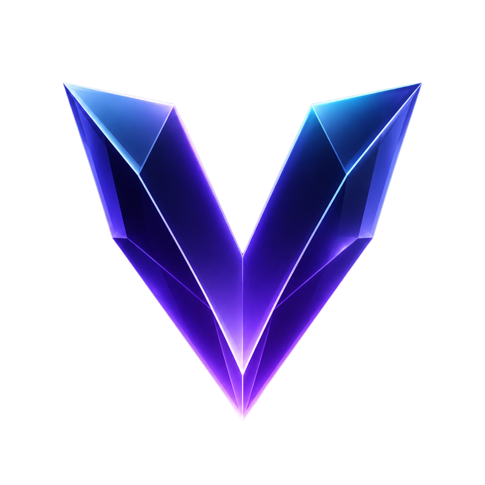
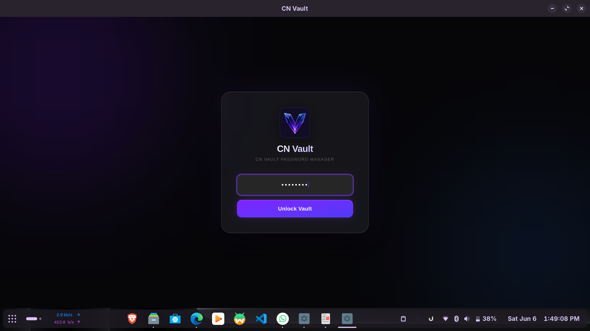
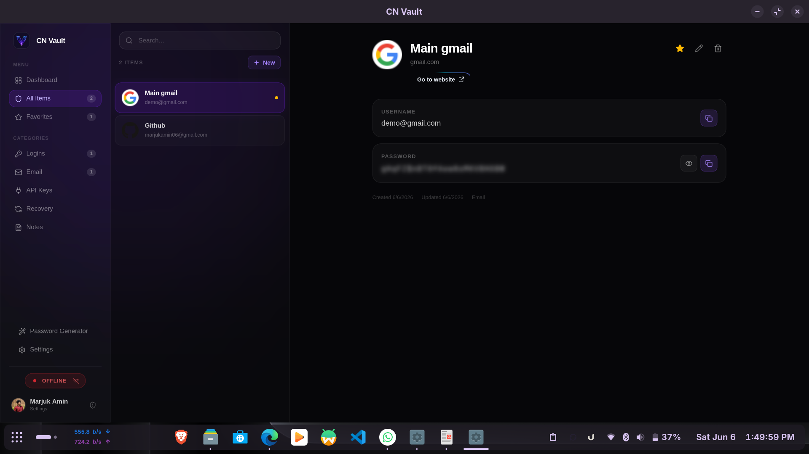
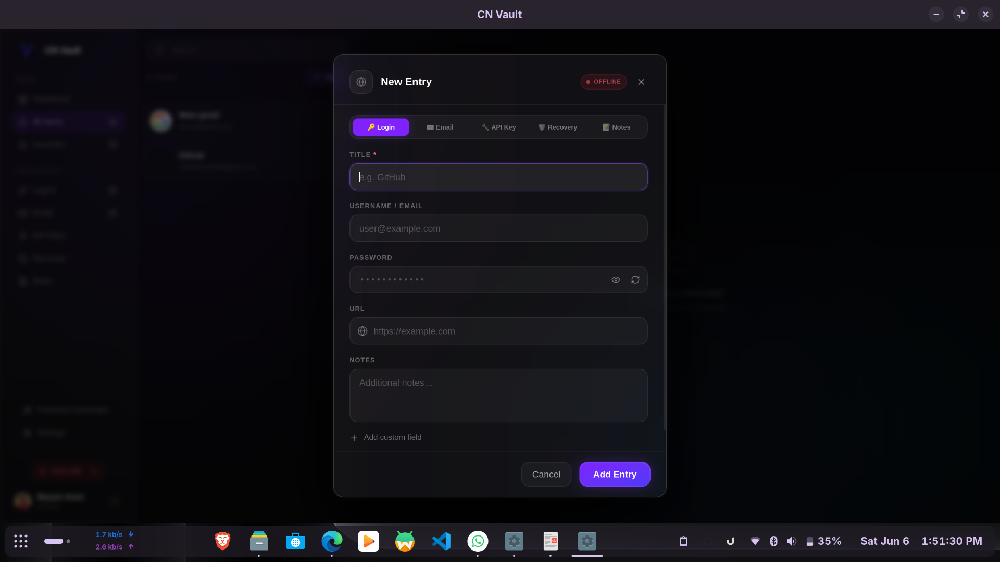
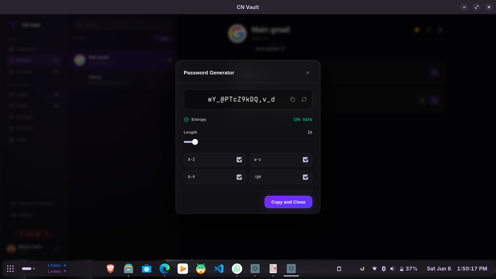
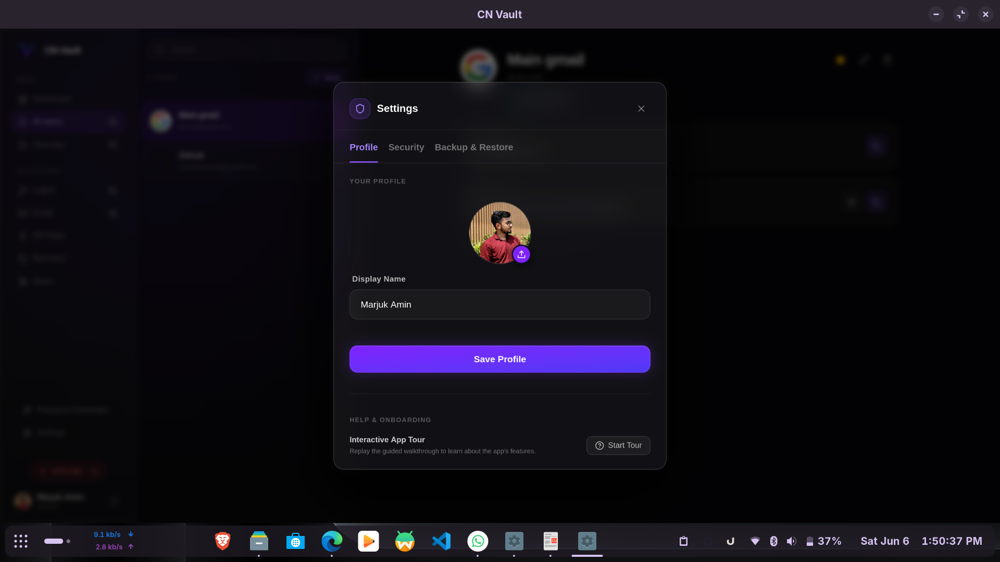
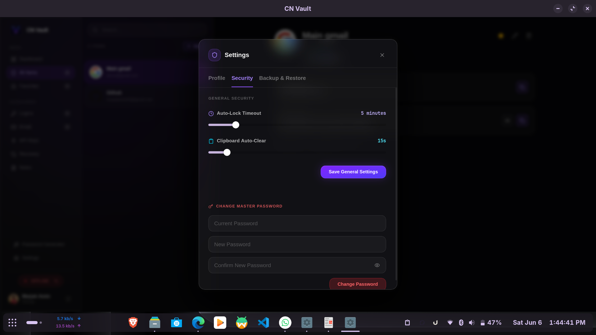
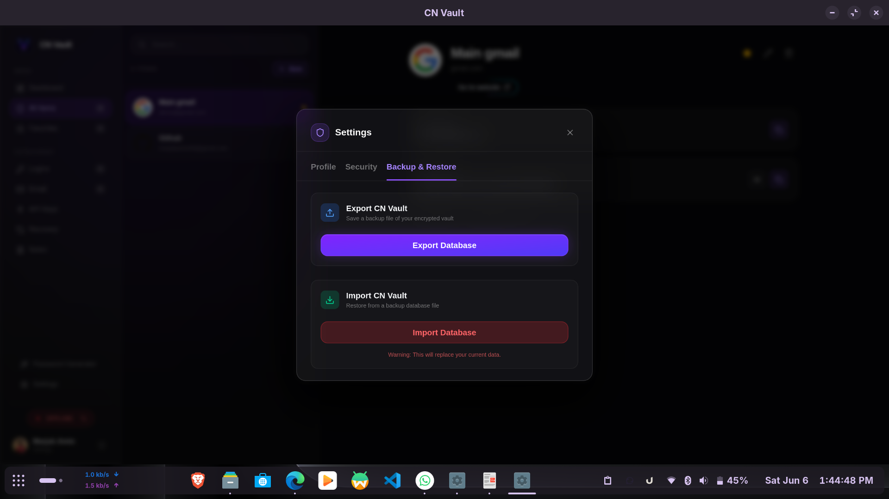
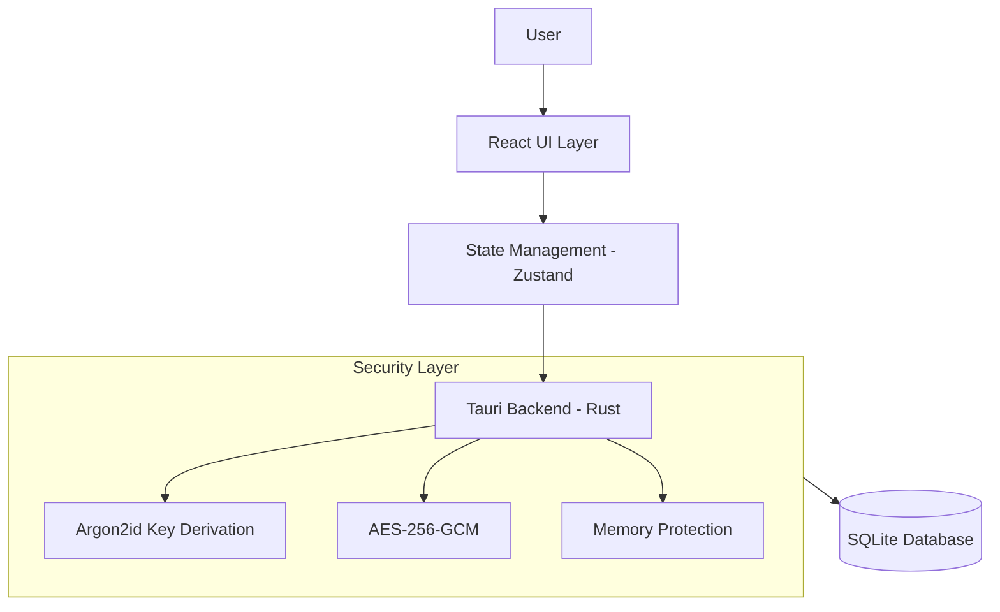
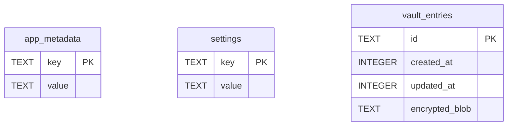

<div align="center">
  
  <h1 style="color: #c084fc;">CN Vault</h1>
  <p><strong>A local-first, secure password manager.</strong></p>
  
  <p>
    <a href="https://snapcraft.io/cn-vault"></a>
    
    
    
    
  </p>
</div>

---

### Linux
The easiest way to install on any Linux distribution is via the Snap Store:
```bash
sudo snap install cn-vault
```
*(Flatpak installation via Flathub is currently pending review).*

### Windows

<a href="https://apps.microsoft.com/detail/9p888nv4qrls?referrer=appbadge&mode=full" target="_blank" rel="noopener noreferrer">
  
</a>

Alternatively, download the automated `.msix` installer from the **Releases** page.

### macOS
*⚠️ macOS is currently not supported. I plan to add support in a future update.*

---

## Screenshots

| Unlock Screen | Dashboard |
| :---: | :---: |
|  |  |

| Add New Entry | Password Generator |
| :---: | :---: |
|  |  |

| Settings (Profile) | Settings (Security) |
| :---: | :---: |
|  |  |

<div align="center">
  <b>Settings (Backup & Restore)</b><br>
  
</div>

---

## Features

### Security
* **AES-256-GCM Encryption**: Authenticated encryption for all vault entries.
* **Argon2id (v0x13)**: Hardened key derivation to prevent GPU brute-forcing.
* **Memory Zeroization**: Passwords and derived keys are wiped from RAM immediately after use.
* **Auto-Lock & Anti-Brute Force**: Inactivity timers and exponential backoff for unlock attempts.

### Core Functionality
* **Categories**: Logins, Email, API Keys, Recovery Codes, and Secure Notes.
* **Password Generator**: Entropy-scoring generator for secure passwords.
* **Auto-Clearing Clipboard**: Passwords copied to the clipboard are automatically cleared after a delay.
* **Instant Search**: Full-text search across credentials and notes.

### Backup System
* **Encrypted Export**: Export your entire vault securely.
* **Integrity Checks**: SQLite `PRAGMA integrity_check` prevents importing corrupted backup files.

---

## Why CN Vault?

**1. Design**  
A modern interface with a premium dark theme, indigo depths, cyan highlights, and a violet glow. 

**2. Local-First**  
CN Vault never sends your vault to the internet. Everything lives in an encrypted SQLite file on your device.

**3. Security**  
We assume the host machine could be compromised. Defense-in-depth measures include database encryption, memory zeroization, clipboard wiping, and strict import verification. No telemetry, no analytics.

---

## Architecture



---

## Tech Stack

| Technology | Purpose |
| :--- | :--- |
| **Rust** | Core backend and cryptography for memory safety and performance. |
| **Tauri** | Application framework for building lightweight native binaries. |
| **React & Zustand** | Component-driven UI and lightweight state management. |
| **SQLite** | Local, atomic, single-file database storage. |
| **TailwindCSS** | Utility-first styling for the UI. |

---

## Project Structure

```text
src-tauri/                 # Rust Backend
├── src/
│   ├── commands.rs        # IPC Handlers
│   ├── crypto.rs          # Argon2id & AES-256-GCM
│   ├── database.rs        # SQLite schemas
│   ├── models.rs          # Rust Structs
│   └── lib.rs             # Tauri Entrypoint
└── tauri.conf.json        

src/                       # React Frontend
├── components/            # Reusable UI components
├── features/              # Feature modules (Auth, Entries, Settings)
├── lib/                   # Utilities & schemas
├── store/                 # Zustand global state
├── index.css              # Global styles
└── App.tsx                # Main Routing
```

---

## Security Details

### Encryption Flow
1. **Input**: User provides the Master Password.
2. **Salt**: A 16-byte CSPRNG salt is fetched from SQLite.
3. **KDF**: Argon2id hashes the password and salt into a 32-byte `SecretKey`.
4. **Zeroize**: The plaintext password string is wiped from RAM.
5. **Encryption**: AES-256-GCM encrypts the entry payload using the `SecretKey` and a fresh 12-byte nonce.
6. **Storage**: The nonce and ciphertext are saved as hex strings in SQLite.

---

## Database Design

The database is a local SQLite file (`vault.db`) using WAL mode.



---

## Installation & Setup

Requires Node.js (v18+) and Rust (v1.77+).

```bash
# Clone the repository
git clone https://github.com/Marjuk06/CN-Vault.git
cd cn-vault

# Install dependencies
npm install

# Run in development mode
npm run tauri dev

# Build for production
npm run tauri build
```

---

## Roadmap

- [x] **V1: Foundation** (SQLite, Argon2id, AES-256-GCM, React UI)
- [ ] **V2: Quality of Life** (Browser Extension, Biometric Unlock)
- [ ] **V3: Mobile** (Android App, Local Wi-Fi Sync)

---

## Contributing

1. Adhere to `rustfmt` for Rust and `eslint`/`prettier` for TypeScript.
2. Ensure all tests pass (`cargo test`) before submitting PRs.
3. Do not introduce cloud dependencies or external network calls.

## Author

**Marjuk Amin** (@Marjuk06)
- 🌐 [Website](https://cnvault.codenestui.top/)
- 💻 [GitHub](https://github.com/Marjuk06)

*This project (CN Vault) is entirely designed, engineered, and maintained by Marjuk Amin.*

---

## License

MIT License. See `LICENSE` for more information.
